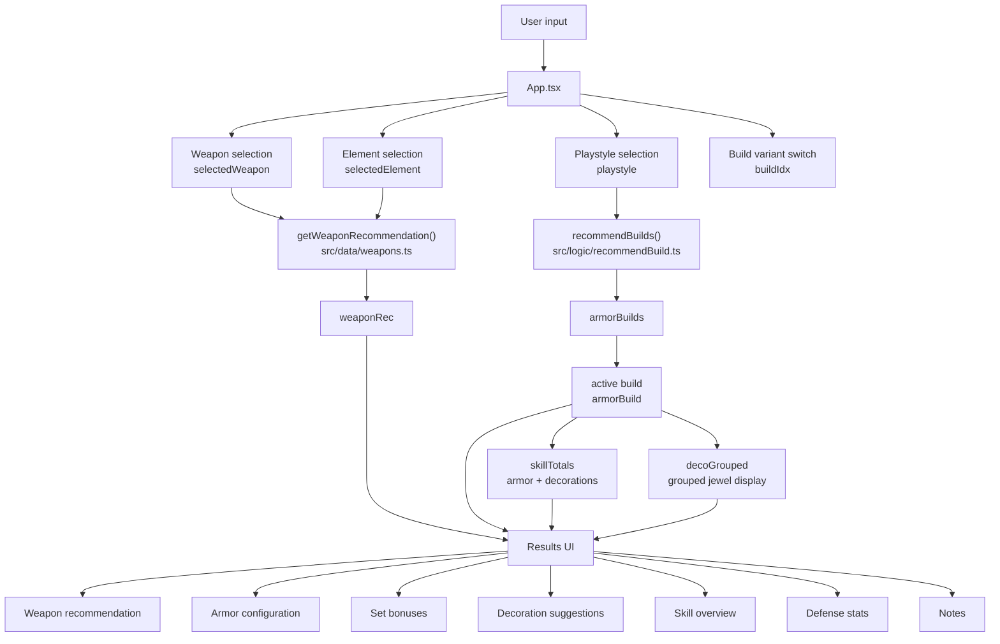
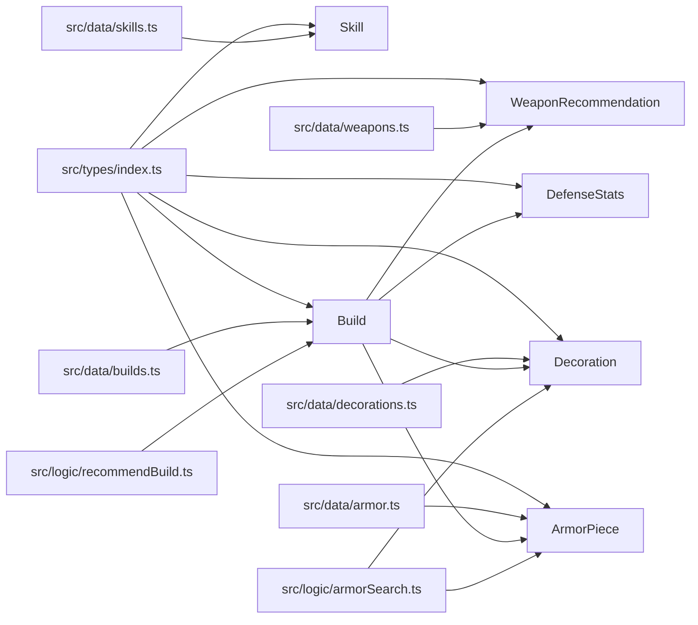

# MH Wilds Build Helper

A lightweight Expo + React Native + TypeScript mobile app scaffold for recommending Monster Hunter Wilds-style builds.

## Current features

- Choose one of three playstyles: attack, defense, balanced
- View a recommended weapon and armor loadout
- View recommended decorations / jewels
- Read skill descriptions and level effects
- Uses a local TypeScript data model (currently limited to in-repo Wilds sample sets only)

## Project structure

- `App.tsx` - single-screen mobile UI
- `src/types` - domain types for builds, armor, skills, decorations
- `src/data` - local sample data for skills, jewels, and builds
- `src/logic` - build recommendation logic
- `src/components` - reusable UI sections
- `src/theme` - shared color tokens

## Architecture

`App.tsx` is the main orchestrator. It tracks the selected weapon, element, playstyle, and active build variant, then combines static data with recommendation logic to render the final loadout view.

### Runtime flow



### Data model



## Run locally

```bash
npm install
npm run start
```

Then open with Expo Go or an emulator.

## Data pipeline

```bash
npm run data:refresh
```

This downloads MHDB API snapshots for `en` and `zh-Hant`, stores Kiranico `zh-Hant` HTML snapshots for cross-checking, normalizes the data, then regenerates app-facing TypeScript data under `src/data/generated`.

Main generated inputs:

- `data/raw/mhdb/**` - MHDB API snapshots
- `data/raw/kiranico/zh-Hant/**` - Kiranico Traditional Chinese snapshots
- `data/normalized/*.json` - local optimizer-ready data
- `src/data/generated/*.ts` - app-facing generated data

Run the MVP armor optimizer directly:

```bash
node scripts/optimize-build.mjs --skills=weakness-exploit:3,agitator:3,peak-performance:3 --limit=5
```

The first optimizer pass covers high-rank armor, armor decorations, decoration slots, target skill scoring, defense score, and basic set-piece preference. Weapon-skill optimization is intentionally separate because Wilds splits weapon and armor skill sources.

## Next recommended upgrades

1. Add weapon-aware optimization and monster weakness scoring
2. Add filtering by weapon type
3. Add search and favorite builds
4. Add richer stat calculations


## Data validation status

- Build presets are generated from local MHDB snapshots and only reference equipment available in normalized data.
- Kiranico `zh-Hant` snapshots are stored for source cross-checking.
- This project is still an offline helper; verify final in-game values against your current game version/patch notes.
