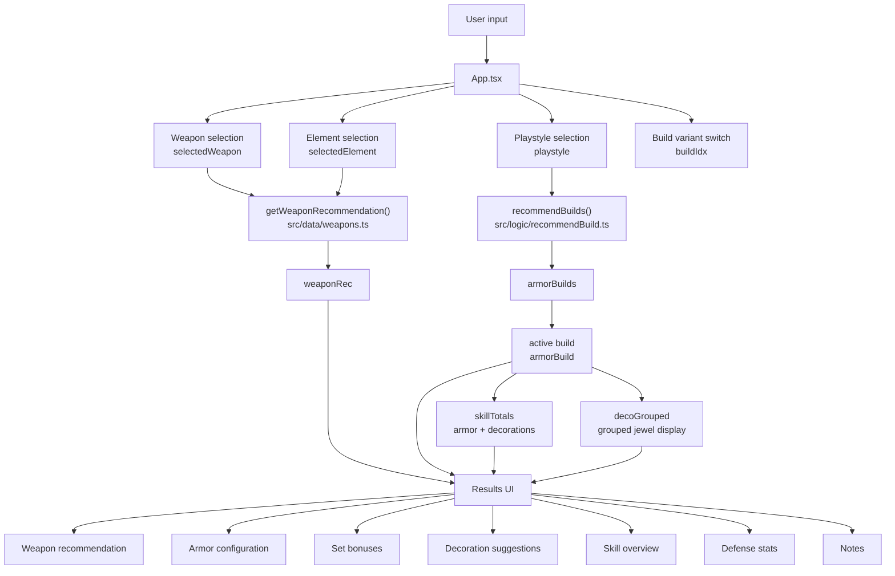
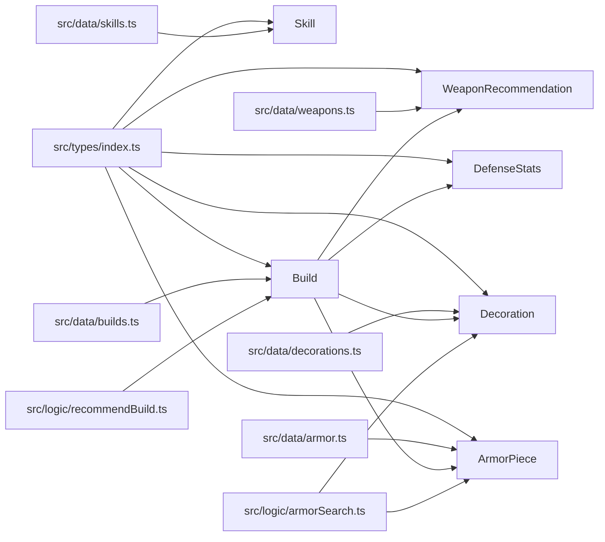

# MH Wilds Build Helper

A lightweight Expo + React Native + TypeScript mobile app scaffold for recommending Monster Hunter Wilds-style builds.

## Current features

- Choose one of three playstyles: attack, defense, balanced
- View a recommended weapon and armor loadout
- View recommended decorations / jewels
- Read skill descriptions and level effects
- Uses a local TypeScript data model (currently limited to in-repo Wilds sample sets only)

## Project structure

- `App.tsx` - single-screen mobile UI
- `src/types` - domain types for builds, armor, skills, decorations
- `src/data` - local sample data for skills, jewels, and builds
- `src/logic` - build recommendation logic
- `src/components` - reusable UI sections
- `src/theme` - shared color tokens

## Architecture

`App.tsx` is the main orchestrator. It tracks the selected weapon, element, playstyle, and active build variant, then combines static data with recommendation logic to render the final loadout view.

### Runtime flow



### Data model



## Run locally

```bash
npm install
npm run start
```

Then open with Expo Go or an emulator.

## Next recommended upgrades

1. Replace sample data with verified Monster Hunter Wilds data files
2. Add filtering by weapon type
3. Add search and favorite builds
4. Add multilingual skill text and richer stat calculations


## Data validation status

- Build presets now only reference equipment defined in `src/data/armor.ts` to avoid cross-title set names.
- This project is still an offline helper; verify final in-game values against your current game version/patch notes.
